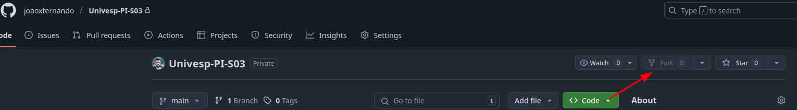
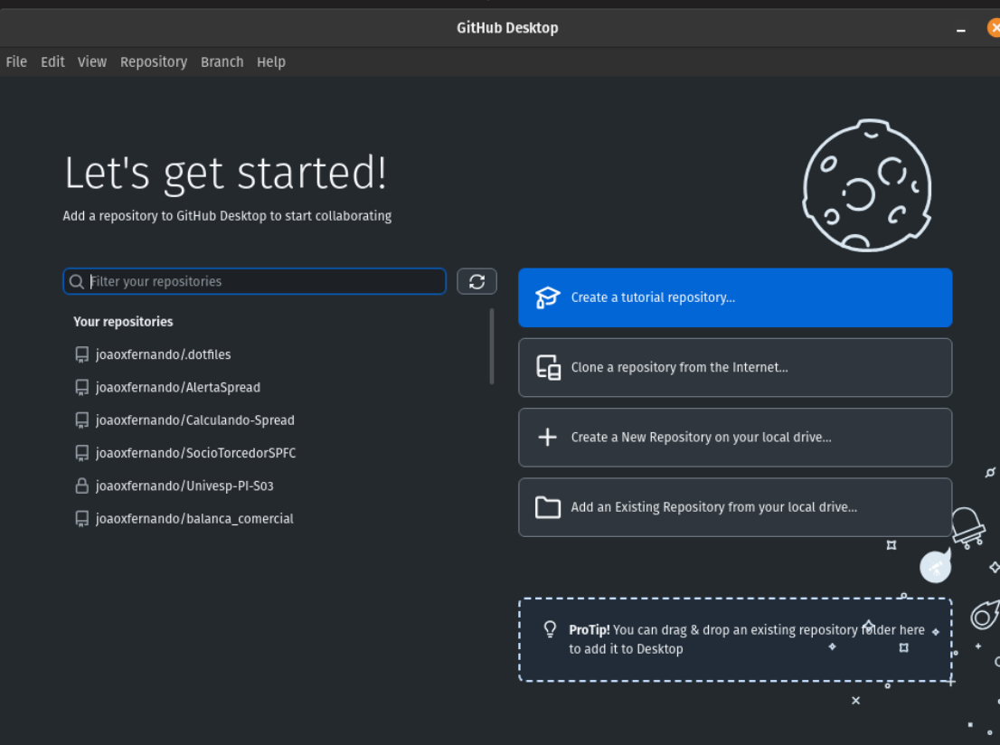
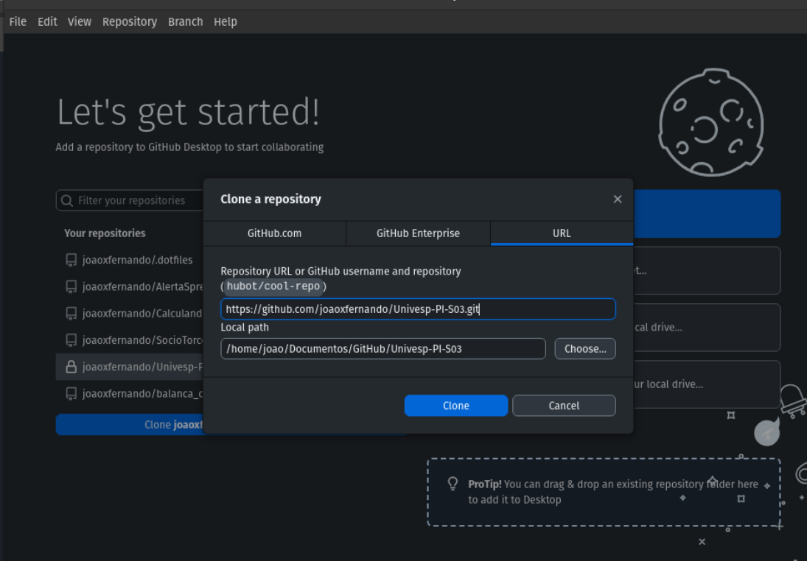
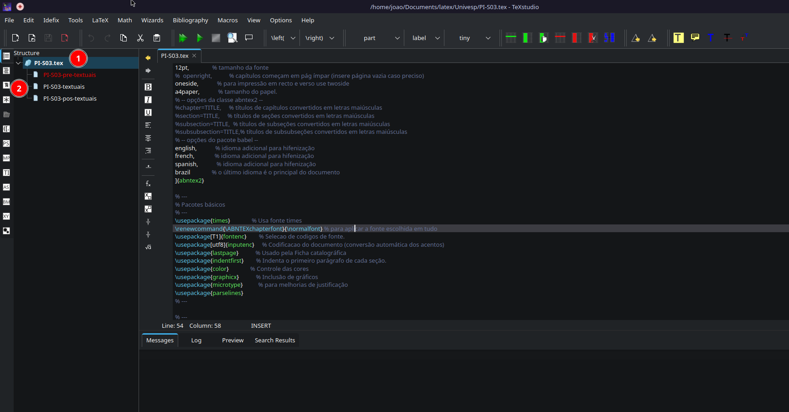
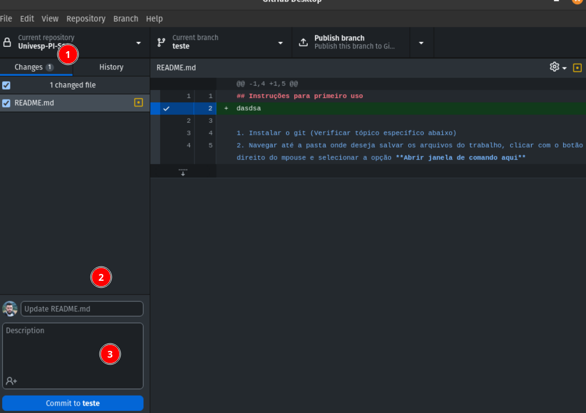
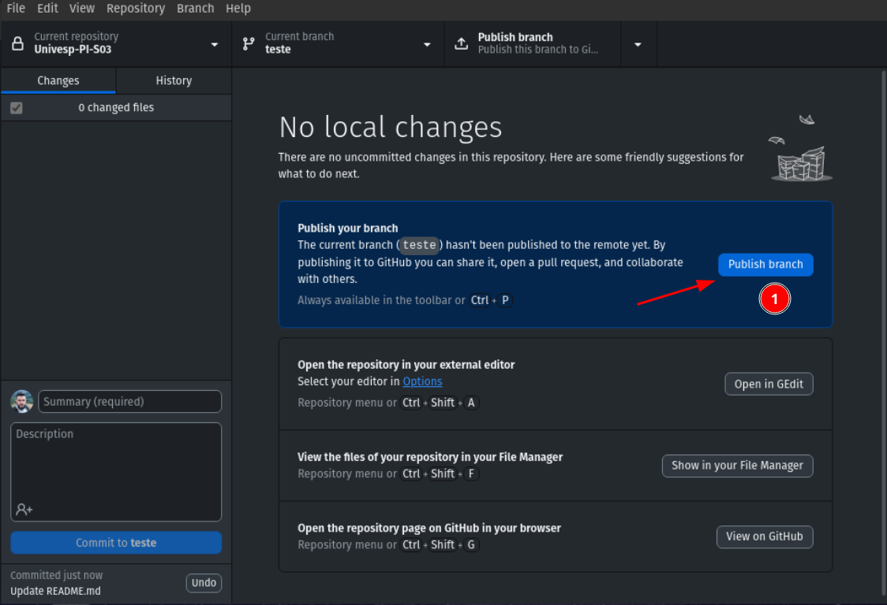

## Instruções para primeiro uso

1. Instalar o git (Verificar tópico específico abaixo)
2. Navegar até a pasta onde deseja salvar os arquivos do trabalho, clicar com o botão direito do mpouse e selecionar a opção **Abrir janela de comando aqui**
3. Clonar o repositório utilizando o comando abaixo dentro do prompt que abriu
```bash
git clone https://github.com/joaoxfernando/Univesp-PI-S03.git
```

Essas etapas só precisam ser feitas uma única vez, e essa última etapa irá baixar os arquivos atualizados para a sua máquina, quando você fizer alterações e quiser sincronizar ou deseja sincronizar com a versão mais recente do servidor, utilize os comandos listados no tópico específico

Se quiser, você pode também acessar a documentação abaixo diretamente na [Wiki](https://github.com/joaoxfernando/Univesp-PI-S03/wiki) onde terá o mesmo conteúdo separado em páginas para facilitar a consulta.

## Instalação e configuração do Git/GitHub Cliente

Se você já tiver familiaridade com o git, não precisa baixar o github client, apenas instale o git, caso contrário, 

[Instale o Git](https://git-scm.com/downloads)

[Instale o GitHub Client](https://docs.github.com/en/desktop/installing-and-authenticating-to-github-desktop/setting-up-github-desktop) (não precisa instalar o git)

Acesse o site do github.com e faça o cadastro, em seguida, acesse a página do [projeto](https://github.com/joaoxfernando/Univesp-PI-S03), vá em fork conforme print abaixo e na janela que se abrir, clique em **Create fork**


Optando por instalar o github client, não há muito o que realizar, basta abri-lo e fazer login em sua conta.

Após efetuado o login, o aplicativo irá mostrar uma tela similar a essa com os seus repisitórios (se você criou a conta agora, irá ter apenas o repositório recém "forkado"). Clique nele e irá aparecer um botão azul escrito clone nome_do_usuario/Univesp-PI-S03, ao clicar irá abrir uma janela pedindo para confirmar. O no primeiro campo, não há necessidade de alterar nada, que é o endereço do repositório. O segundo campo é o caminho onde ficará armazenado os arquivos, não há necessidade de alterar, mas, fica a seu critério 




Feito isso, você pode seguir para a próxima etapa que é a de configuração do LaTeX para poder trabalhar no projeto. Você não precisará manter o github aberto enquanto edita trabalha no projeto, apenas quando quiser salvar as alterações e eventualmente subi-las para o servidor. Essas etapas serão abordadas no tópico **Trabalhando no projeto e sincronizando com o github**

Se quiserem, há um curso básico, mas que abrange bastante tópicos sobre github no YouTube > [https://www.youtube.com/playlist?list=PLcoYAcR89n-qbO7YAVj5S0alABLis_QVU](https://www.youtube.com/playlist?list=PLcoYAcR89n-qbO7YAVj5S0alABLis_QVU). Sugiro assistir os 4 primeiro vídeos pra aprender o bê-a-bá, até pq lá eles focam no uso via linha de comando que é um pouco mais avançado para quem não tem o hábito, então muito do que é visto além daquilo, pode acabar confundindo.


## Instalação do LaTex

O LaTeX (leia-se Látequi) é um sistema de composição tipográfica, é utilizado principalmente para criar documentos técnicos e científicos de alta qualidade. Ele é altamente flexível na personalização de documentos, onde é possível padronizar muitas configurações antes do conteúdo ser produzido, fazendo com que foquemos apenas no conteúdo sem precisar se preocupar com formatação. No Word por exemplo, a formatação é toda visual, ou seja, a gente digita o texto e selecionamos em botões/caixas de seleções a formatação desejada. No LaTeX essa formatação é feita via códigos/comandos, então podemos ter um maior controle sobre a formatação.

O foco será na digitação do trabalho, vocês não precisam se preocupar com a formatação. O único cuidado que peço é que tópico, seja digitado os comandos "/chapter{Título do tópico}", e caso haja algum subtópico, usar os comandos "/subsection{Título do subtópico}", "/subsubsection{...}"  e assim por diante. Logo abaixo vocês podem quebrar a linha e digitar o conteudo.

Exemplo:
/chapter{A Álgebra no cotidiano}
Texto ....

/subsection{Importância de ...}
Novo texto

Como visto, não precisamos enumerar esses capítulos, isso será feito automaticamente na hora de compilar e gerar o PDF.

Para utilização do LaTeX, vamos usar a ferramenta TexStudio, utilize [esse link](https://www.texstudio.org/#download) para baixá-lo. Se usar linux, baixe o arquivo .exe e faça a instalação, após concluída, abra o arquivo PI-S03.tex no TexStudio, irá aparecer uma tela similar a essa.


O item 1 é o arquivo que acabamos de abrir, e abaixo os outros três que estão com uma especíe de ramo do primeiro, são arquivos que iremos trabalhar. O primeiro arquivo é onde todo os comandos de configuração serão ajustados e os demais contarão com os textos, não necessitando de códigos além dos que citei anteriormente para referenciar tópicos e subtópicos e eventualmente algum código para inserção de imagens, citação, equação matemática, mas isso pode ser visto caso a caso, conforme for surgindo a necessidade.

## Trabalhando no projeto e sincronizando com o github


O git utiliza o conceito de branch, que é a ramificação, ou seja, uma forma de separar a **ramificação** que está sendo trabalhada. Ótima para trabalho em equipe, já que cada um pode focar em uma etapa/ramificação do projeto sem impactar no que os colegas estão trabalhando.

Seguiremos um padrão de nomenclatura das branchs: **nome-da-seção/nome-da-pessoa**, utilizando traços/hífens no lugar dos espaços entre o nome da seção e da pessoa e barra separando o nome da seção e o nome da pessoa. 
Exemplo: importancia-da-algebra/joao-fernando

Sempre que for realizar alguma alteração no projeto, dentro do Github Desktop, localize a opção Branch no menu do topo e vá em New Branch e crie uma nova branch conforme descrito anteriormente. Após isso, você pode fazer as devidas edições nos arquivos normalmente.

Dessa forma fica fácil identificar e ter controle de cada etapa do trabalho para caso precisamos voltar um passo atrás. 

Ao concluir as edições, para enviar as alterações para o github ou até mesmo deixar registrada todas as alterações até aquele ponto. Você deve **"comittar"**, que é basicamente fazer um comentário documentando o que foi alterado. Abrindo o github desktop, dentro do repositório do projeto, irá aparecer a tela de "Changes" onde constará no item 1 a quantidade de arquivos que foram alterados, nesse caso 1. No item 2 e 3, são os campos para documentar a alterações. O 2 pode deixar vazio que ele preenche por padrão como update e nome do arquivo, mas, se quiser pode preencher com um resumo do que foi adicionado. Exemplo: "add importancia da algebra". E no 3º item é uma mensagem mais descritiva, mas não precisa ser extensa. Embaixo tem o botão commit to **nome da branch** (nesse caso teste), e para curiosidade. No campo a direita, ele exibe o documento e em verde ele sinaliza as informações novas. Quando há um símbolo de + à esquerda, é pq é uma linha nova, se tivesse em vermelho e com -, seria uma linha que no documento atualizado não existe mais.


Após commitar, ele irá sugerir que façamos o **push** (ou Publish) para o servidor, essa etapa não é obrigatória, caso você pretenda realizar mais edições em breve, pode ignorar e continuar editando, assim que surgir novas alterações ele irá sinalizar e você pode fazer o processo de commit da etapa anterior novamente, quando você finalmente fizer o push, ele irá enviar todos os commits anteriores, logo, não há necessidade de fazer o push a cada commit.


Lembre-se, tudo isso está sendo feito em seu repositório e não no oficial do projeto. Quando quiser submeter o que você editou, mesmo antes de finalizá-lo por completo, terá que ser feito o processo chamado de **Pull Request** a maneira mais fácil (na minha opinião) é pelo site. Basta abrir a pagina do projeto no seu github, ir em Pull Request e depois New Pull Request. Na janela que abrir, no campo da esquerda, selecione o repositório oficial do projeto e o da direita o seu repositório. Onde está compare: main na direita, será o nome da branch que você trabalhou, o da esquerda, que é o do projeto, será sempre **main**.


Após isso, digite um título, bem similar ao que fazemos no commit. Se tiver tudo ok, irá aparecer a mensagem que não há conflitos (é mais comum quando duas ou mais pessoas editam os mesmos trechos do arquivo) e basta clicar em **Create Pull Request**. Pronto, a sua parte já foi feita. O restante será feito diretamente no repositório oficial do projeto.

Caso queira fazer pelo aplicativo, sugiro que sigam as etapas a seguir [https://docs.github.com/en/desktop/working-with-your-remote-repository-on-github-or-github-enterprise/creating-an-issue-or-pull-request-from-github-desktop](https://docs.github.com/en/desktop/working-with-your-remote-repository-on-github-or-github-enterprise/creating-an-issue-or-pull-request-from-github-desktop), em caso de dúvidas podem me acionar. Não consigo fazer um fork do meu próprio repositório para exemplificar.


### Puxar atualizações do servidor

Após você ter enviado as alterações para o servidor e feita a solicitação de **Pull Request**, quando ela for aprovada, caso queira atualizar a sua versão com a do repositório oficial, digite os comandos abaixo no terminal dentro da pasta do teu projeto:

```bash
# se der erro com a linha abaixo, tente o comando seguinte
git remote add upstream git@github.com:joaoxfernando/Univesp-PI-S03.git
# ou então esse
git remote add upstream https://github.com/joaoxfernando/Univesp-PI-S03.git

git fetch upstream
git merge upstream/main

# agora você pode enviar as alterações que acabou de puxar do repositório oficial para o seu repositório
git push origin main # ou então pode usar o próprio Github Desktop para enviar as alterações.
```


## Principais comandos git

### git status

Verifica se há arquivos que faltam commitar e enviar pro servidor/github.

### git commit -m ""

Sempre antes de enviar qualquer alteração, precisamos fazer o commit, que é um resumo do que foi alterado, para aí sim fazer o push (envio dos dados).

### git add

Quando adicionamos algum arquivo novo no projeto, para que ele seja enviado para o github, é necessáriorodar o comando **git add nome_do_arquivo** ou **git add .** (sim, com um ponto no final) para que ele adicione o novo arquivo ou todos os novos arquivos caso utilize a opção com o ponto no final.

### git reset

Caso tenha commitado, mas ainda não fez o git push e deseja desfazer o commit, você pode utilizar o comando git reset. Caso tenha feito o push, verificar o comando git revert logo abaixo

### git revert

Se quiser reverter o último commit no servidor, utilize o comando **git revert HEAD~1**

Há diversos outros comandos para utilização do git, mas, creio que para a elaboração do projeto, esses são mais do que suficientes.

Qualquer dúvida quanto ao uso do git e/ou LaTeX, podem me acionar no e-mail 24201690@aluno.univesp.
